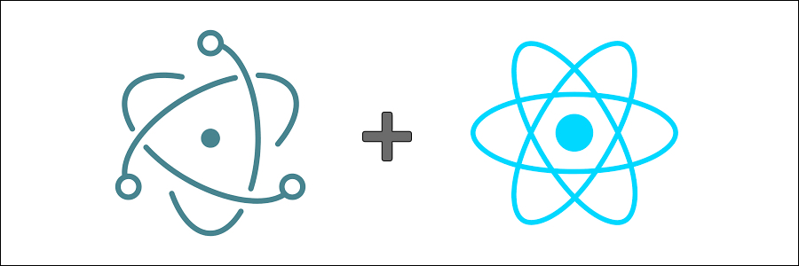

# reactron

<div style="text-align: center;">
	
</div>

Electron boilerplate with React, Babel, Browserify and Gulp.

```shell
# Clone Repository
$ git clone https://github.com/Teddy95/reactron.git my-project

# Go into root directory
$ cd my-project

# Install dependencies
$ npm install

# Compile App
$ npm run build

# Run App
$ npm start
```

Happy Coding! :heart: :sparkles:

### File structure

##### Development in `/app`

- `/app` Electron index.html & main.js
- `/app/assets` Logos, images, icons, ...
- `/app/css` Your Css files
- `/app/js` Your React Js files
- `/app/sass` Your Sass/Scss files

##### Production in `/build`
- `/build` Electron index.html & main.js copied from `/app`
- `/build/assets` Files copied from `/app/assets`
- `/build/css` Here you find the `style.min.css` generated from all Css files in `/app/css`
- `/build/js` Here you find the `bundle.min.js` with contains the Js code of your React application

### Scripts

##### Watch Scripts

Watching the following scripts and compile they, if there were changes.

```
app/sass/*.scss
app/css/*.css
app/js/**/*
app/*.html
app/*.js
```

```shell
$ npm run watch
```

##### Build App

Compile application and generate `/build` directory.

```shell
$ npm run build
```

##### Release App

Packaged Applications get storaged in `/release` directory.

**Configurations:**

Set product name & icons in `package.json`.

```json
{
	"name": "reactron",
	"productName": "Reactron - Electron Boilerplate",
	"build": {
		"icon": {
			"mac": "build/assets/icons/icon.icns",
			"windows": "build/assets/icons/icon.ico",
			"linux": "build/assets/icons/icon.png"
		}
	}
}
```

**Packaging:**

_Packaging for Mac OS X_:

```shell
$ npm run build
$ npm run package-mac
```

_Packaging for Windows_:

```shell
$ npm run build
$ npm run package-windows
```

_Packaging for Linux_:

```shell
$ npm run build
$ npm run package-linux
```

...or release it all at once:

```shell
$ npm run release
```
